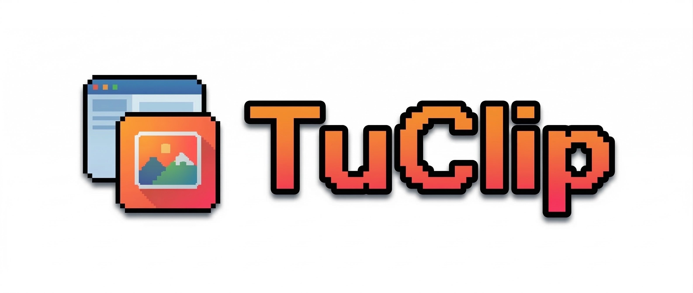
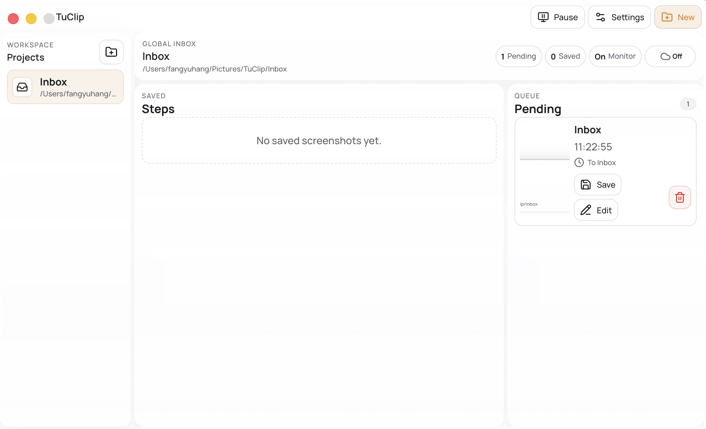

<div align="center">
  
  <p>
    <a href="./README.md"><strong>简体中文</strong></a> ·
    <a href="./README_EN.md"><strong>English</strong></a>
  </p>
  <p>
    
    
    
    
    
    
  </p>
</div>

TuClip is a screenshot management tool.

- After a screenshot reaches the clipboard, it first goes into a pending queue.
- Then you decide whether to save it, annotate it, skip it, or place it into a workspace.

## Run Locally

Requirements:

- Node.js `20.19+` or `22.12+`
- npm

First-time setup:

```bash
git clone <repository-url>
cd TuClip
npm install
```

Development mode:

```bash
npm run dev
```

Start Electron directly:

```bash
npm start
```

Build:

```bash
npm run build
```

## Screenshot



## What It Is Good For

TuClip is a good fit if you often work on:

- software tutorials
- knowledge-base articles or notes with screenshots
- documents where you need to revise annotations without changing image paths
- projects with many step images that should be organized by workspace and tag

## Main Features

- **Clipboard monitoring**  
  Detects new screenshot images and puts them into a pending queue. When monitoring is enabled, it starts recording the clipboard state.

- **Pending popup**  
  Supports save, edit, note, and tags.

- **Workspaces and tags**  
  You can create a workspace for each project, or keep images in the global Inbox first.

- **Annotation editor**  
  Currently supports rectangles, numbered markers, text labels, and crop, while keeping edit history.

- **Stable export paths**  
  Final images are stored directly in the workspace root, such as `001.png` and `002.png`.

- **Remote features**  
  - WebDAV: sync the whole workspace
  - S3 / R2: publish final images as remote links

## Data Storage

Final images are stored in the workspace root. Internal data is stored in the hidden `.tuclip/` directory.  
App-level configuration and remote-sync state are stored in Electron `userData/state`.
